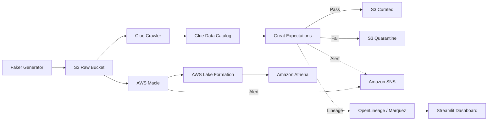

# Platform Architecture — aws-data-quality-governance

## Architecture Overview

## Core Governance Components
- **Data Generator**: Faker synthetic PII generator
- **Data Catalog**: AWS Glue Crawler + Database
- **Data Quality**: Great Expectations checkpoint runner
- **PII Detection**: AWS Macie on-demand classification
- **Access Governance**: AWS Lake Formation column masking & row-level tags
- **Alerting**: Amazon SNS + Slack Lambda handler
- **Lineage**: OpenLineage + Marquez local container
- **Orchestration**: Apache Airflow DAG
- **Visualization**: Streamlit 5-tab governance dashboard
