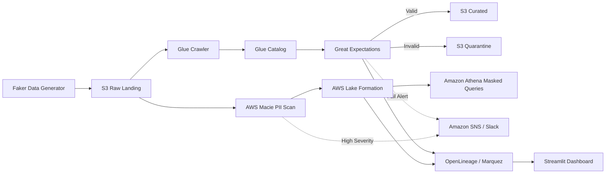

# aws-data-quality-governance

An open-source, portfolio-grade AWS-native data quality, cataloging, PII detection, and access governance platform built by **Jayant Verman**.

## Why I Built This

While building production data engineering pipelines, I realized that data pipelines are only as good as their data quality and security governance. In modern enterprise lakehouses, raw landing zones frequently capture PII (emails, SSNs, phone numbers) that must be detected, quarantined, masked, and audited before downstream analysts query them. I built this platform to demonstrate how AWS-native tools (Glue, Macie, Lake Formation, Athena) integrate with industry-standard open-source frameworks (Great Expectations, OpenLineage, Marquez, Apache Airflow, Streamlit) to deliver robust data governance.

## Architecture



## Tech Stack & Versions

| Layer | Component | Description / Pin |
|---|---|---|
| **Synthetic Data** | `Faker` | Generates realistic PII customer datasets (Faker 24.x) |
| **Data Quality** | `Great Expectations` | Validation suites & quarantine routing (GE 0.18.x) |
| **Cataloging** | `AWS Glue Data Catalog` | Schema inference & automated cataloging |
| **PII Detection** | `AWS Macie` | On-demand automated PII classification scans |
| **Access Governance** | `AWS Lake Formation` | Column-level masking & row-level LF-tags |
| **Lineage** | `OpenLineage + Marquez` | End-to-end dataset lineage tracking |
| **Orchestration** | `Apache Airflow` | DAG orchestration (Airflow 2.8.x) |
| **Dashboard** | `Streamlit` | Interactive quality & governance UI (Streamlit 1.30.x) |
| **Infrastructure** | `Terraform` | Declarative IaC modules (Terraform 1.7.x) |

## Estimated AWS Cost Breakdown

This platform is engineered to stay strictly within the AWS Free Tier during normal testing:

| Service | Estimated Usage / Cost | Notes |
|---|---|---|
| **AWS Glue Catalog** | $0.00 | First 1M catalog requests free |
| **Amazon S3** | $0.00 | Under 5 GB free storage tier |
| **AWS Macie** | ~$0.00 | Free 30-day trial quota per account (runs on-demand) |
| **AWS Lake Formation** | $0.00 | Free governance service (governs Athena/S3) |
| **Amazon SNS** | $0.00 | First 1M publishes free |
| **Total Estimated Cost** | **$0.00 - $0.10** | Teardown script provided for instant cleanup |

## Quickstart

### Prerequisites
- AWS CLI configured with valid credentials (`aws configure`)
- Python 3.11+
- Terraform 1.7+
- Docker Desktop

### 1. Clone & Setup
```bash
git clone https://github.com/JayantVerman/aws-data-quality-governance.git
cd aws-data-quality-governance
./scripts/setup.sh
```

### 2. Provision Infrastructure
```bash
cd infra
terraform init
terraform plan
terraform apply -auto-approve
cd ..
```

### 3. Run Pipeline
```bash
./scripts/run_pipeline.sh
```

### 4. Start Dashboard & Lineage
```bash
docker compose up -d
streamlit run viz/streamlit_app/app.py
```

## Safe Infrastructure Teardown

To guarantee zero lingering costs on AWS, execute the teardown script:
```bash
./scripts/teardown.sh yes
```

## Lake Formation Governance Demo

### Privileged Role (Full Access)
```sql
SELECT customer_id, first_name, email, ssn FROM customers LIMIT 1;
-- Output:
-- CUST-0000001 | John | john.doe@email.com | 123-45-6789
```

### Restricted Role (Column Masked)
```sql
SELECT customer_id, first_name, email, ssn FROM customers LIMIT 1;
-- Output:
-- CUST-0000001 | John | [MASKED] | [MASKED]
```

## Running Tests

```bash
./scripts/run_tests.sh
```

## Roadmap & Known Limitations

- **Macie Scan Scheduling**: Intentionally triggered on-demand rather than scheduled recurring to eliminate recurring classification costs.
- **Spark Processing**: Built with Pandas / PyArrow for local lightweight execution; expandable to PySpark on AWS EMR for multi-terabyte datasets.

## Acknowledgments & AI Assistance Disclosure

Built by **Jayant Verman**. AI tools (ChatGPT) were utilized to scaffold boilerplate Terraform definitions and Airflow DAG wiring. Architecture decisions, data quality rules, governance policies, and debugging were designed and driven by me in future it will be need some upgrades so follow its structure or i will update it by my self time to time and if anyone find any problem or any fault and any need to improvement so let me know it by commenting on it we can discuss it as healthy tech talk.

## License

MIT License. See [LICENSE](LICENSE) for details.
